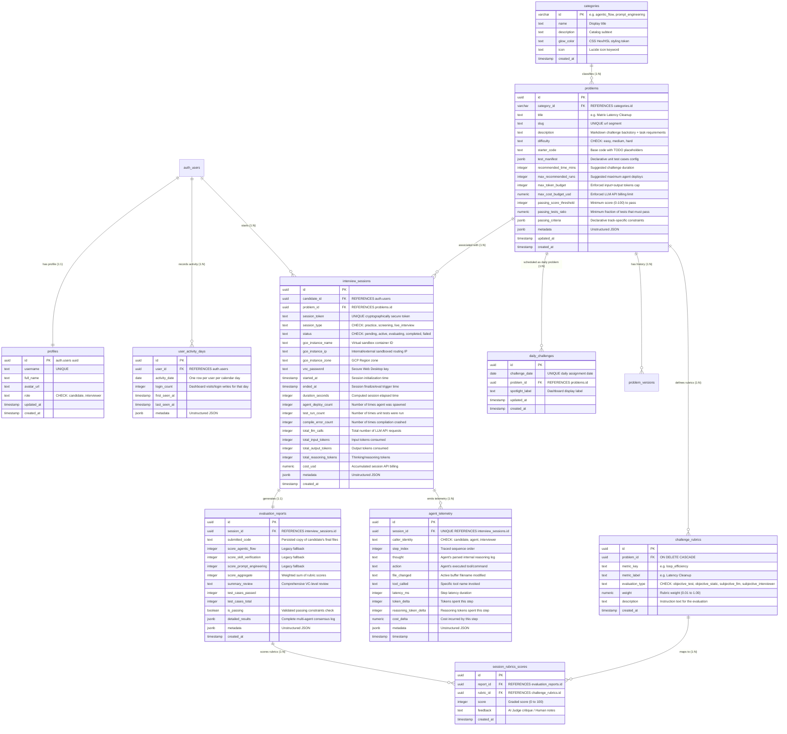

# 🗄️ AntiCode Database Schema Handbook

Welcome to the **AntiCode** Database Architecture Guide. This document serves as the single source of truth for our PostgreSQL schema, relational structures, metric boundaries, triggers, and Row-Level Security (RLS) policies.

All developers (and Autonomous Agents) must read and update this guide whenever schema migrations are added or altered inside `supabase/schema.sql`.

---

## 🗺️ Entity Relationship Blueprint

The database is built on top of **Supabase** (PostgreSQL). It maps individual developer profiles, categorical challenge version catalogs, isolated VM sandbox telemetry, and highly precise consensus evaluations.



---

## 🗄️ Database Table Definitions

### 1. `public.profiles`
Stores supplementary profile configurations for registered users.
*   **Permissions Role Check**: Enforces `candidate` (normal candidate operations) or `interviewer` (escalated interviewer privileges).
*   **Sync Logic**: Synchronized automatically on auth signups via database trigger function.

### 2. `public.categories`
High-tech challenge categorization parameters. Contains HSL styling colors and Lucide icon keys for rendering visually premium glow headers.

### 3. `public.daily_challenges`
Stores the database-selected daily challenge shown on `/dashboard`.
*   **One row per date**: `challenge_date` is unique, so the dashboard reads exactly one configured daily problem for the current date.
*   **Problem link**: `problem_id` references `public.problems`, keeping daily assignments tied to the canonical challenge catalog rather than a hardcoded client fallback.
*   **RLS**: Authenticated users can read daily challenge rows; interviewer accounts can manage them.

### 4. `public.problems`
The central assignment problem catalog. Contains:
*   **Budgets vs Actuals**: Establishes expectation thresholds (`recommended_time_mins`, `max_recommended_runs`).
*   **Enforcements**: Enforces hard resource budgets (`max_token_budget`, `max_cost_budget_usd`).
*   **Passing Criteria**: Track-specific passing requirements (`passing_score_threshold`, `passing_tests_ratio`).
*   **Unstructured payload (`metadata` column)**: Allows storing arbitrary GCE VM container settings or environment flags.

### 5. `public.challenge_rubrics`
Stores non-hardcoded evaluation metrics.
*   **Evaluation Source Separation**: Clearly divides metric categories via `evaluation_type` (`objective_test`, `objective_static`, `subjective_llm`, `subjective_interviewer`).
*   **Mathematical Integrity**: Enforces that sum of weights per challenge equals exactly `1.00` using a deferrable constraint trigger, allowing multi-row rubric updates inside one transaction.

### 6. `public.interview_sessions`
Active, programmatic interview trial sessions. Tracks token economic consumption, total test runs, duration, and VNC secrets.
*   **Automatic Duration Calculation**: Uses database trigger to auto-compute `duration_seconds` upon transitioning status to `'completed'`.
*   **Realtime Streaming Channel**: Enabled for Realtime streaming publications so updates propagate directly into the candidate cockpit.

### 7. `public.agent_telemetry`
High-speed step-by-step tracing logs emitted during code execution. Segregates actions by Candidate, Autonomous Agent, or Interviewer override loads.

### 8. `public.evaluation_reports`
The final scorecard summary detailing aggregated results and the median Best-of-3 Gemini structured review. A unique index on `session_id` keeps the relationship one scorecard per interview session.

### 9. `public.session_rubrics_scores`
Individual score breakdown records corresponding to active rubrics for the given problem scorecard.

### 10. `public.user_activity_days`
Stores one row per authenticated user per calendar day for dashboard login streaks.
*   **Source of truth for streaks**: `/dashboard` calls `public.record_user_login_day()` when it loads, then computes the visible streak from `user_activity_days`.
*   **No client-side fake counters**: The dashboard displays empty states or DB errors when rows are missing rather than manufacturing stats.
*   **RLS**: Users can read and write only their own activity rows; interviewers can inspect activity across users.

---

## ♻️ Idempotent Migration Strategy

`supabase/schema.sql` is safe to run against both a fresh Supabase project and an existing project:

*   `CREATE TABLE IF NOT EXISTS` declares all canonical table shapes.
*   `ALTER TABLE ... ADD COLUMN IF NOT EXISTS` backfills additive fields that older projects may be missing.
*   Check constraints that evolved during the formulation plan, such as `profiles_role_check` and `interview_sessions_session_type_check`, are dropped and recreated idempotently.
*   Runtime indexes are declared with `CREATE INDEX IF NOT EXISTS`, including `idx_profiles_username` for unique non-null usernames, `idx_daily_challenges_challenge_date` for the dashboard daily problem lookup, `idx_user_activity_days_user_date` for login streak queries, and `idx_evaluation_reports_session_id`, which enforces the one-report-per-session invariant.
*   Realtime publication membership is checked before each `ALTER PUBLICATION`, avoiding destructive `DROP PUBLICATION` resets.

---

## ⚡ Real-Time Streaming & Publications

Our Cockpit HUD leverages **Supabase Realtime** to automatically stream sandbox telemetry updates directly into client dashboards.

The schema registers `public.interview_sessions` and `public.agent_telemetry` into the `supabase_realtime` publication only when they are not already present.

### Subscribing to Telemetry Changes:
```typescript
const channel = supabase
  .channel(`session-telemetry-${sessionId}`)
  .on(
    "postgres_changes",
    {
      event: "UPDATE",
      schema: "public",
      table: "interview_sessions",
      filter: `id=eq.${sessionId}`
    },
    (payload) => {
      const updatedSession = payload.new;
      console.log("Realtime Session Telemetry Received:", updatedSession);
    }
  )
  .subscribe();
```

---

## 🛡️ Database Triggers

### Auto-Calculating Session Elapsed Duration
Upon completion, the database trigger automatically computes the candidate's exact elapsed time, avoiding client-side timing manipulation.

```sql
CREATE OR REPLACE FUNCTION public.compute_session_duration()
RETURNS TRIGGER AS $$
BEGIN
    IF NEW.status = 'completed' AND OLD.status IS DISTINCT FROM 'completed' THEN
        NEW.ended_at := COALESCE(NEW.ended_at, NOW());

        IF NEW.started_at IS NOT NULL THEN
            NEW.duration_seconds := GREATEST(
                0,
                EXTRACT(EPOCH FROM (NEW.ended_at - NEW.started_at))::integer
            );
        END IF;
    END IF;
    RETURN NEW;
END;
$$ LANGUAGE plpgsql;

CREATE TRIGGER tr_compute_session_duration
BEFORE UPDATE ON public.interview_sessions
FOR EACH ROW
EXECUTE FUNCTION public.compute_session_duration();
```

### Mutable Record Timestamps
`public.set_updated_at()` keeps `profiles.updated_at`, `daily_challenges.updated_at`, and `problems.updated_at` synchronized whenever those rows change.

### Login Activity Recording
`public.record_user_login_day()` writes or increments the authenticated user's `user_activity_days` row for `CURRENT_DATE`. The dashboard uses that persisted data to calculate login streaks.

### Rubric Weight Integrity
`public.validate_challenge_rubric_weight_sum()` is attached to `challenge_rubrics` as a `DEFERRABLE INITIALLY DEFERRED` constraint trigger. It blocks commits where a problem has rubrics but the total weight is not exactly `1.00`.

---

## 🔒 Security & Row-Level Security (RLS)

All private tables have RLS enabled.
1.  **Profiles**: Profile rows remain readable for user-facing identity display; updates are restricted to the owning authenticated user.
2.  **Catalog Tables**: `categories`, `problems`, `problem_versions`, and `challenge_rubrics` are readable by candidates, while write operations require `public.is_interviewer()`.
3.  **Sessions**: Insert, select, and update access is scoped to the session-owning candidate or an account with the `interviewer` role.
4.  **Daily Challenges**: `daily_challenges` is readable by authenticated users and writable only by interviewers.
5.  **Telemetry and Scorecards**: `agent_telemetry`, `evaluation_reports`, and `session_rubrics_scores` use session ownership subqueries so candidates can write/read their own interview artifacts and interviewers can observe or manage live reviews.
6.  **Activity Days**: `user_activity_days` is scoped to the owning user for dashboard login streaks, with interviewer read/write access for administrative workflows.
7.  **Rubric Weight Adjustment**: Interactive weight adjustment in Interviewer Control Decks enforces role-checking and the deferrable weight-sum trigger to prevent unauthorized or mathematically invalid grading matrices.

---

## 🧪 Seed and Sync Scripts

Use `npm run seed:test-users` to run `scripts/create-test-users.mjs`. The script uses the Supabase service role key from `.env.local` to create or update the demo candidate and interviewer auth users, then upserts matching rows in `public.profiles` so role changes are reflected even when an auth user already existed before the signup trigger was installed. The same script also seeds dashboard starter data: today's `daily_challenges` row, consecutive `user_activity_days` rows for login streaks, deterministic interview sessions, and matching evaluation scorecards.
