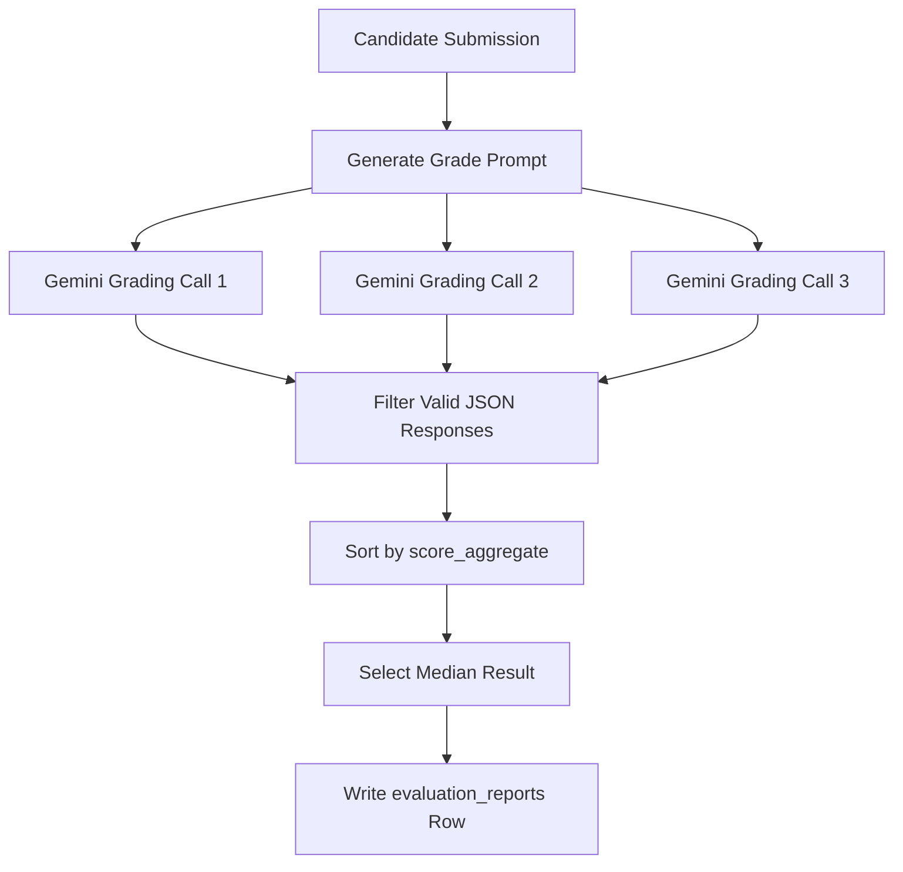

# AntiCode AI Interview Evaluations

This skill governs the code grading pipeline, which connects directly to the Google Gemini Developer API to provide high-fidelity scorecards of candidate interview submissions.

## 1. Consensus Evaluation Engine Architecture
To eliminate LLM grading variance, the evaluation system in [src/lib/evaluation/evaluator.ts](file:///Users/rana-ms-work/Documents/gemini-hackathon/src/lib/evaluation/evaluator.ts) uses a **Best-of-3 Consensus Engine**:



1. **Parallel Execution**: Triggers three concurrent API calls to Gemini `gemini-3.5-flash` using `Promise.all`.
2. **Schema-Specified JSON**: Uses Gemini's `responseSchema` configuration to enforce structured output.
3. **Consensus Selection**: Sorts the returning payloads by `score_aggregate` and selects the **median** scorecard.

## 2. Evaluation Metrics (0 to 100)
Candidates are scored across three dimensions:

*   **score_agentic_flow**: Evaluates loop efficiency, autonomous task scheduling, and error-handling logging inside the candidate's agent blocks.
*   **score_skill_verification**: Evaluates structural parser validity, safety edge cases (such as handling malformed streams or huge buffers), and type conformity.
*   **score_prompt_engineering**: Evaluates red-team immunity against jailbreaking, Grandma exploits, prompt injection overrides, or credential leak vectors.
*   **score_aggregate**: Mathematical average of the three categories.

## 3. Gemini Developer API Schema Spec
The evaluator uses the following JSON schema config:

```json
{
  "type": "OBJECT",
  "properties": {
    "score_agentic_flow": { "type": "INTEGER" },
    "score_skill_verification": { "type": "INTEGER" },
    "score_prompt_engineering": { "type": "INTEGER" },
    "score_aggregate": { "type": "INTEGER" },
    "summary_review": { "type": "STRING" }
  },
  "required": [
    "score_agentic_flow",
    "score_skill_verification",
    "score_prompt_engineering",
    "score_aggregate",
    "summary_review"
  ]
}
```

## 4. Fallback Grading Stability
If `GEMINI_API_KEY` is not present, or if all parallel API threads crash, the service uses `generateFallbackMockGrade` in [src/lib/evaluation/evaluator.ts](file:///Users/rana-ms-work/Documents/gemini-hackathon/src/lib/evaluation/evaluator.ts) to provide extremely realistic scorecards tailored to each `problemSlug`, maintaining UI/UX integrity.

## 5. Guidelines for Future Updates
> [!TIP]
> - **Prompt Tweaks**: Keep the summary review to roughly 3 concise sentences. The tone must remain strict, constructive, encouraging, and represent a VC technical evaluation.
> - **Models**: To migrate to another model (e.g. `gemini-3.5-pro`), update the `GEMINI_JUDGE_MODEL` variable in [evaluator.ts](file:///Users/rana-ms-work/Documents/gemini-hackathon/src/lib/evaluation/evaluator.ts) or the `.env.local` config.
