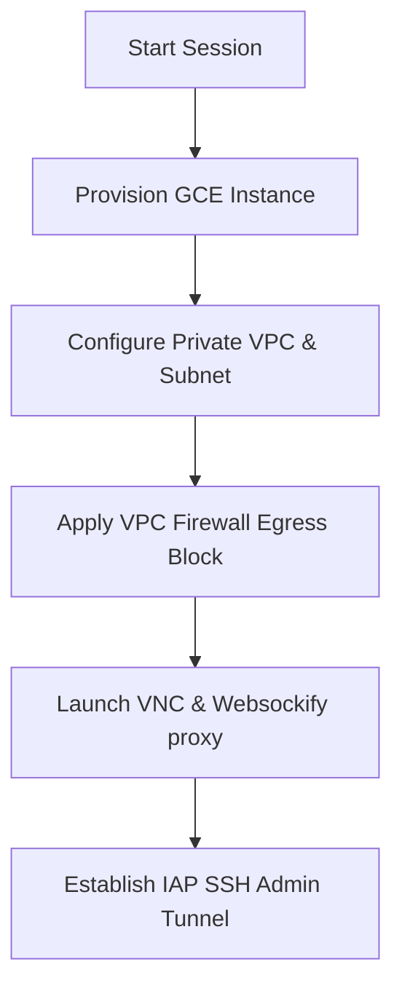

# YeetCode GCP Interfacing & Cloud Resources

This skill governs the integration with Google Cloud Platform (GCP) used to provision isolated sandboxes, host containerized microservices, manage events, and secure credential secrets.

## 1. GCP Authentication & Identity
Access to GCP services requires authenticating with a Google Service Account:
- **`gcp-key.json`**: Standard service account credentials file containing the private key. It must reside in the root of the project but **MUST NEVER** be committed to version control.
- **`GOOGLE_APPLICATION_CREDENTIALS`**: Environment variable mapped to the absolute path of the key file (e.g. `GOOGLE_APPLICATION_CREDENTIALS="gcp-key.json"`).

## 2. isolated Compute Engine (GCE) VM Sandboxes
To execute candidate code securely, the system provisions dedicated virtual instances on the fly:



### Sandbox Configuration Parameters
*   **Machine Type**: Standard `n2-standard-4` (4 vCPUs, 16 GB memory) to ensure fast compile times.
*   **Operating System**: Ubuntu 24.04 LTS custom "Golden Image" pre-installed with the Google Antigravity CLI/IDE.
*   **SSH Credentials**: Accessible via administrative account name `interview` using RSA key pairs (`GCP_GCE_ADMIN_SSH_PUBLIC_KEY` and `GCP_GCE_ADMIN_SSH_PRIVATE_KEY_PATH`).

### Network Isolation & Hardening
*   **Private Shards**: All VMs run inside `GCP_VPC_NETWORK="yeetcode-vpc"` and `GCP_SUBNET="yeetcode-subnet"`.
*   **Egress Blocking**: A strict VPC firewall rule (`GCP_FIREWALL_RULE_ISOLATED="block-external-egress"`) blocks all outbound internet access from inside the candidate sandbox, preventing code leakage or scraping.
*   **Public IP Disable**: Sandboxes operate without public IP addresses (`GCP_PUBLIC_IP_ENABLED="false"`) to protect them from external scanner scripts.

## 3. Remote Linux Desktop Delivery (noVNC)
To render the sandboxed Linux GUI inside the candidate's browser:
1.  **VNC Server**: Active inside the GCE instance listening on localhost loopback (`127.0.0.1:5901`).
2.  **Websockify Proxy**: Converts VNC TCP frames to WebSocket protocol over port `6080` (`NOVNC_PROXY_PORT="6080"`).
3.  **noVNC client**: Embedded inside the browser IDE workspace to render the WebSocket streams live.

## 4. Google Cloud Secret Manager
Critical API keys and service roles are securely loaded at runtime from Secret Manager to avoid plain-text storage:
*   `supabase-service-key`: Secret name configured as `GCP_SECRET_NAME_SUPABASE_KEY`.
*   `gemini-api-key`: Secret name configured as `GCP_SECRET_NAME_GEMINI_KEY`.

## 5. Microservice Containers (Cloud Run & Artifact Registry)
*   **Container Host**: The API server runs on **Google Cloud Run** (`GCP_CLOUD_RUN_SERVICE_NAME="yeetcode-api"`).
*   **Docker Registry**: Docker images are built and pushed to **GCP Artifact Registry** (`GCP_ARTIFACT_REGISTRY_REPO="yeetcode-docker-repo"`).

## 6. Event Streaming (Cloud Pub/Sub)
We use Pub/Sub topics to coordinate asynchronous tasks across decoupled processors:
*   **`evaluation-jobs`**: Dispatches candidate submission code to worker nodes for offline grading.
*   **`vm-events`**: Listens to VM lifecycle changes (creation, idle timeouts, destruction).

## 7. Identity-Aware Proxy (IAP) Fallback
For secure administrative CLI control or diagnostics without public IPs, establish an IAP SSH tunnel over port 22:
```bash
gcloud compute start-iap-tunnel [INSTANCE_NAME] 22 \
  --project=[GCP_PROJECT_ID] \
  --zone=[GCP_ZONE] \
  --local-host-port=localhost:2222
```

## 8. Guidelines for Future Updates
> [!CAUTION]
> *   **Credential Safety**: Never bypass pre-commit hook checks on `gcp-key.json` or other JSON key formats.
> *   **VM Leak Protection**: Ensure that VM cleanup runs (`VM_CLEANUP_MODE="destroy"`) are triggered at session completion to prevent runaway cloud bills.
