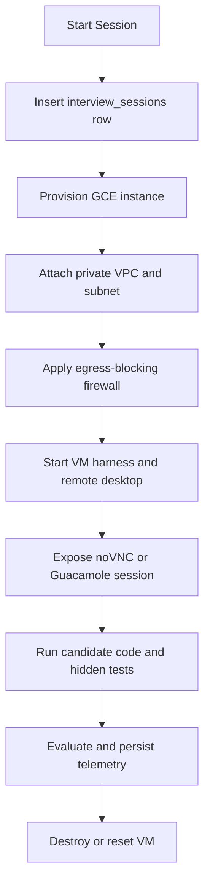

# AntiCode GCP Interfacing & Cloud Resources

This skill governs every Google Cloud Platform (GCP) and Google-hosted API touchpoint used by AntiCode. Use it whenever changing cloud infrastructure, sandbox provisioning, evaluation execution, deployment settings, cloud secrets, or resource documentation.

## 1. Resource Inventory

| Area | Resource | Config / Name | Current repo status | Purpose |
| --- | --- | --- | --- | --- |
| AI evaluation | Gemini Developer API | `GEMINI_API_KEY`, `GEMINI_JUDGE_MODEL`, endpoint `generativelanguage.googleapis.com` | Actively implemented | Single-pass structured grading in `src/lib/evaluation/evaluator.ts`. |
| Candidate agent | Gemini Developer API | `GEMINI_API_KEY`, `GEMINI_CASE_MODEL`, endpoint `generativelanguage.googleapis.com` | Actively implemented | Powers the local `bin/antigravity` coding agent. |
| Auth to GCP | Service account key | `gcp-key.json`, `GOOGLE_APPLICATION_CREDENTIALS` | Documented/configured | Needed for future GCP SDK or `gcloud` calls. Do not commit. |
| Sandboxes | Compute Engine | `GCP_GCE_ZONE`, `GCP_GCE_MACHINE_TYPE`, `GCP_GCE_IMAGE_*`, `GCP_GCE_OS_DISK_SIZE_GB` | Documented/configured; UI and DB simulate metadata today | Intended runtime for isolated candidate workspaces. |
| Sandbox network | VPC/Subnet/Firewall | `GCP_VPC_NETWORK`, `GCP_SUBNET`, `GCP_FIREWALL_RULE_ISOLATED`, `GCP_PUBLIC_IP_ENABLED` | Documented/configured | Private VM placement and outbound egress blocking. |
| Remote desktop | noVNC/websockify | `REMOTE_DESKTOP_PROVIDER`, `NOVNC_*` | Documented/configured; UI references this surface | Browser delivery of the sandbox desktop. |
| Remote desktop option | Apache Guacamole | `GUACAMOLE_*` | Optional documented fallback | Alternative browser desktop gateway. |
| Secrets | Secret Manager | `GCP_SECRET_NAME_SUPABASE_KEY=supabase-service-key`, `GCP_SECRET_NAME_GEMINI_KEY=gemini-api-key` | Documented/configured | Runtime secret retrieval for production deployments. |
| API hosting | Cloud Run | `GCP_CLOUD_RUN_SERVICE_NAME=anticode-api` | Documented/configured | Intended container host for API services. |
| Images | Artifact Registry | `GCP_ARTIFACT_REGISTRY_REPO=anticode-docker-repo` | Documented/configured | Intended Docker image registry. |
| Async work | Pub/Sub | `GCP_PUBSUB_TOPIC_EVALUATIONS=evaluation-jobs`, `GCP_PUBSUB_TOPIC_VM_EVENTS=vm-events` | Documented/configured | Intended dispatch for grading jobs and VM lifecycle events. |
| Admin access | Identity-Aware Proxy | `GCP_IAP_TUNNEL_TARGET_PORT=22` | Documented/configured | Private SSH/admin tunnel for VMs with no public IP. |
| Cost controls | VM/evaluation budgets | `VM_*`, `MAX_VM_COST_USD_PER_SESSION`, `MAX_GEMINI_COST_USD_PER_SESSION`, `MAX_JUDGE_CALLS_PER_SESSION` | Documented/configured | Session limits, cleanup policy, and billing guardrails. |

## 2. Current Implementation Status

Be precise when describing the platform:

- The Gemini Developer API is the only Google-hosted API actively called by current code. It is called directly over HTTPS from `src/lib/evaluation/evaluator.ts` for grading and from `bin/antigravity` for candidate agent prompts.
- The current Next.js workspace and execution APIs use local filesystem sandboxes under `candidate_workspace/` and local process execution. They do not currently provision GCE instances.
- The UI and database record GCE-like metadata, including generated instance names and zones, but this is currently metadata/simulation unless a separate provisioning worker is added.
- `package.json` does not currently include `@google-cloud/*`, `googleapis`, or other Google Cloud client SDK dependencies.
- Cloud Run, Artifact Registry, Pub/Sub, Secret Manager, IAP, noVNC, and GCE are documented as the intended production/cloud architecture and exposed through `.env.example`, but there is not yet first-party provisioning code in this repo.

When adding real cloud provisioning, update this section from "documented/configured" to "actively implemented" and list the exact file paths that call each service.

## 3. Source Of Truth Files

Keep these files synchronized whenever cloud resources, names, or behavior change:

- `.env.example`: every public non-secret configuration key and safe default resource name.
- `skills/gcp-interfacing/SKILL.md`: this complete resource inventory and operating guidance.
- `DB_SCHEMA.md`: any database column used to store cloud resource state, VM metadata, cost data, lifecycle state, or telemetry.
- `supabase/schema.sql`: schema and seed data corresponding to `DB_SCHEMA.md`.
- `README.md`: high-level product architecture only. Do not make it the detailed resource inventory.
- `webapp_pages.md`: update only when cloud-related route handlers or App Router pages are added, removed, or moved.
- `skills/github-workflows/SKILL.md` and `scripts/install-hooks.sh`: update if new credential filenames, service account files, or private key types are introduced.

## 4. Authentication & Identity

Access to GCP services requires a Google service account:

- `gcp-key.json`: standard service account credentials file. It may reside in the project root for local development but must never be committed.
- `GOOGLE_APPLICATION_CREDENTIALS`: absolute or project-relative path to the key file, for example `GOOGLE_APPLICATION_CREDENTIALS="gcp-key.json"`.
- `GCP_PROJECT_ID`: target project for GCP resource operations.
- `GCP_REGION`: default regional location, currently `us-central1`.
- `GCP_ZONE`: default zonal location, currently `us-central1-a`.

Security requirements:

- `gcp-key.json` is ignored by `.gitignore`.
- `scripts/vercel-env-sync.mjs` intentionally skips `GOOGLE_APPLICATION_CREDENTIALS` because it points to a local credential file path.
- Never sync raw service account JSON, private keys, `.pem`, `.key`, `.pub`, or generated credentials into Vercel, Supabase, or source control.
- Run `bash scripts/install-hooks.sh` before staging cloud-related changes so local secret scanning hooks are installed.

## 5. Gemini Developer API

AntiCode currently uses the Gemini Developer API directly rather than Vertex AI:

- `GEMINI_API_KEY`: required for live Gemini calls.
- `GEMINI_JUDGE_MODEL`: model for structured interview grading, default `gemini-3.5-flash`.
- `GEMINI_CASE_MODEL`: model for the Antigravity coding agent, default `gemini-3.5-flash`.
- `GEMINI_FEEDBACK_MODEL`: reserved for feedback workflows.
- `GEMINI_JUDGE_TRIES`: intended number of grading attempts, default `3`.
- `GEMINI_JUDGE_TEMPERATURE`: intended judging temperature, default `0.2`.
- `GEMINI_JUDGE_THINKING_LEVEL`: intended thinking setting, default `medium`.

Live code paths:

- `src/lib/evaluation/evaluator.ts` calls `https://generativelanguage.googleapis.com/v1beta/models/${GEMINI_JUDGE_MODEL}:generateContent?key=${GEMINI_API_KEY}` and requests strict JSON output.
- `bin/antigravity` calls `https://generativelanguage.googleapis.com/v1beta/models/${GEMINI_CASE_MODEL}:generateContent?key=${GEMINI_API_KEY}` for direct agent edits.

Fallback requirements:

- If `GEMINI_API_KEY` is absent or all grading calls fail, the evaluator must fall back to realistic local grades instead of breaking the candidate flow.
- Do not log `GEMINI_API_KEY`, request URLs containing the key, or raw headers.

## 6. Compute Engine VM Sandboxes

Target production sandbox design:



Default sandbox parameters:

- Machine type: `n2-standard-4` with 4 vCPUs and 16 GB memory.
- Zone: `us-central1-a`.
- OS: Ubuntu 24.04 LTS custom golden image.
- Admin username: `interview`.
- SSH credentials: `GCP_GCE_ADMIN_SSH_PUBLIC_KEY` and `GCP_GCE_ADMIN_SSH_PRIVATE_KEY_PATH`.
- Instance name pattern: `anticode-sandbox-[slug]-[random_id]`.
- Disk size: `GCP_GCE_OS_DISK_SIZE_GB`, default `128`.
- Image selectors: `GCP_GCE_IMAGE_PROJECT`, `GCP_GCE_IMAGE_FAMILY`, `GCP_GCE_IMAGE_NAME`.

Database touchpoints:

- `public.interview_sessions.gce_instance_name`
- `public.interview_sessions.gce_instance_ip`
- `public.interview_sessions.gce_instance_zone`
- `public.interview_sessions.vnc_password`
- `public.interview_sessions.metadata` for unstructured VM settings or provider-specific flags.

Lifecycle and cost controls:

- `VM_POOL_MIN_WARM`
- `VM_POOL_MAX_ACTIVE`
- `VM_SESSION_TTL_MINUTES`
- `VM_IDLE_TIMEOUT_MINUTES`
- `VM_CLEANUP_MODE`, default `destroy`
- `MAX_VM_COST_USD_PER_SESSION`
- `SESSION_ARTIFACT_RETENTION_DAYS`

Do not leave VMs running after session completion. Any real provisioning code must include cleanup on normal completion, error, timeout, and abandoned sessions.

## 7. Network Isolation

Candidate sandbox VMs must be private by default:

- `GCP_VPC_NETWORK="anticode-vpc"`
- `GCP_SUBNET="anticode-subnet"`
- `GCP_FIREWALL_RULE_ISOLATED="block-external-egress"`
- `GCP_PUBLIC_IP_ENABLED="false"`

Rules:

- Do not enable public IPs unless explicitly needed for a documented debugging procedure.
- Keep outbound internet blocked inside candidate sandboxes to reduce data exfiltration, scraping, and hidden-test leakage.
- Any exception to egress blocking must be narrow, temporary, logged in repo documentation, and linked to the relevant challenge/runtime requirement.

## 8. Remote Desktop Delivery

Primary documented provider:

- `REMOTE_DESKTOP_PROVIDER="novnc"`
- `REMOTE_DESKTOP_PUBLIC_BASE_URL`
- `REMOTE_DESKTOP_TOKEN_SECRET`
- `REMOTE_DESKTOP_SESSION_TTL_SECONDS`, default `7200`
- `NOVNC_BASE_URL`
- `NOVNC_WEBSOCKET_BASE_URL`
- `NOVNC_PROXY_HOST`
- `NOVNC_PROXY_PORT`, default `6080`
- `NOVNC_VNC_HOST`, default `127.0.0.1`
- `NOVNC_VNC_PORT`, default `5901`
- `NOVNC_PASSWORD`

Expected runtime:

- VNC server listens inside the GCE instance on loopback `127.0.0.1:5901`.
- websockify converts VNC TCP frames to WebSocket traffic on port `6080`.
- The browser embeds the noVNC client for the candidate workspace.

Optional fallback provider:

- `GUACAMOLE_BASE_URL`
- `GUACAMOLE_API_URL`
- `GUACAMOLE_ADMIN_USERNAME`
- `GUACAMOLE_ADMIN_PASSWORD`
- `GUACAMOLE_DATABASE_URL`
- `GUACAMOLE_JWT_SECRET`

## 9. Secret Manager

Documented production secrets:

- `GCP_SECRET_NAME_SUPABASE_KEY="supabase-service-key"`
- `GCP_SECRET_NAME_GEMINI_KEY="gemini-api-key"`

Rules:

- Store production API keys and service-role credentials in Secret Manager rather than plain text env files.
- Local `.env.local` may contain development-only values and is ignored by Git.
- If code is added to read Secret Manager, also add explicit local fallback behavior for development and update `.env.example`.
- Never print secret payloads or derived credentials in server logs.

## 10. Cloud Run & Artifact Registry

Documented production deployment targets:

- Cloud Run service: `GCP_CLOUD_RUN_SERVICE_NAME="anticode-api"`.
- Artifact Registry repository: `GCP_ARTIFACT_REGISTRY_REPO="anticode-docker-repo"`.

Rules:

- Do not hardcode project IDs, regions, repository URLs, or service names in code.
- Build and deploy code must read from env/config.
- If Cloud Run deployment code is added, document required IAM roles, service account identity, ingress mode, concurrency, CPU/memory, and timeout settings here.
- If Artifact Registry usage is added, document the image path format and cleanup/retention policy here.

## 11. Pub/Sub Event Streaming

Documented topics:

- `GCP_PUBSUB_TOPIC_EVALUATIONS="evaluation-jobs"`: dispatches candidate submissions or grading work to worker processes.
- `GCP_PUBSUB_TOPIC_VM_EVENTS="vm-events"`: publishes VM lifecycle events such as create, ready, idle timeout, destroy, and cleanup failure.

Rules:

- Pub/Sub messages must not contain raw candidate secrets, service account keys, or hidden test contents.
- Include idempotency keys for VM lifecycle operations and evaluation jobs.
- Workers must be safe to retry.
- If Pub/Sub code is added, document topic schemas, subscriptions, dead-letter behavior, and retry policy here.

## 12. Identity-Aware Proxy

IAP is the documented fallback for private administrative access to VMs without public IPs:

```bash
gcloud compute start-iap-tunnel [INSTANCE_NAME] 22 \
  --project=[GCP_PROJECT_ID] \
  --zone=[GCP_ZONE] \
  --local-host-port=localhost:2222
```

Configuration:

- `GCP_IAP_TUNNEL_TARGET_PORT="22"`

Rules:

- Use IAP for diagnostics and emergency administration only.
- Do not require candidate traffic to depend on IAP.
- Do not document real instance names, usernames beyond the intended `interview` account, or private key paths in shared logs.

## 13. Evaluation Harness

Relevant cloud-facing evaluation settings:

- `EVALUATION_WORKER_CONCURRENCY`
- `EVALUATION_JOB_TIMEOUT_SECONDS`
- `EVALUATION_SANDBOX_PROVIDER`, default `vm`
- `EVALUATION_RUN_HIDDEN_TESTS_IN`, default `worker`
- `TEST_CASE_MAX_FILE_MB`
- `TEST_CASE_MAX_ARCHIVE_MB`
- `TEST_CASE_TIMEOUT_SECONDS`
- `TEST_CASE_ALLOW_ARBITRARY_CODE`
- `MAX_PRACTICE_SESSIONS_PER_USER_PER_DAY`
- `MAX_JUDGE_CALLS_PER_SESSION`
- `MAX_GEMINI_COST_USD_PER_SESSION`
- `MAX_VM_COST_USD_PER_SESSION`

Rules:

- Hidden tests should remain outside the candidate-editable workspace.
- Candidate commands must not reveal hidden test paths, secret env vars, or parent directories.
- Keep graceful fallbacks for local/demo mode when cloud workers or Gemini calls are unavailable.

## 14. Required Update Checklist

When changing any GCP or Google API resource:

1. Update `.env.example` with any new non-secret key and safe default.
2. Update this skill with the resource, implementation status, lifecycle, IAM/security notes, and owner file paths.
3. Update `DB_SCHEMA.md` and `supabase/schema.sql` if database state changes.
4. Update `webapp_pages.md` if an App Router page or API route is added/removed/moved.
5. Update `README.md` only for high-level architecture changes.
6. Update `.gitignore`, `skills/github-workflows/SKILL.md`, and `scripts/install-hooks.sh` if new credential file patterns are introduced.
7. Verify that no secrets, private keys, service account JSON, or generated credentials are staged.

## 15. Agent Guardrails

- Preserve the current fallback behavior: local sandboxes must keep working without GCP credentials.
- Keep cloud names configurable through env vars; do not hardcode production identifiers.
- Prefer structured SDK/client calls over shelling out to `gcloud` in app runtime code. Shelling out is acceptable for scripts when documented.
- Any real VM provisioning must include teardown on success, error, timeout, and idle expiry.
- Any new cloud integration must clearly state whether it is active code, deployment config, or future/intended architecture.
