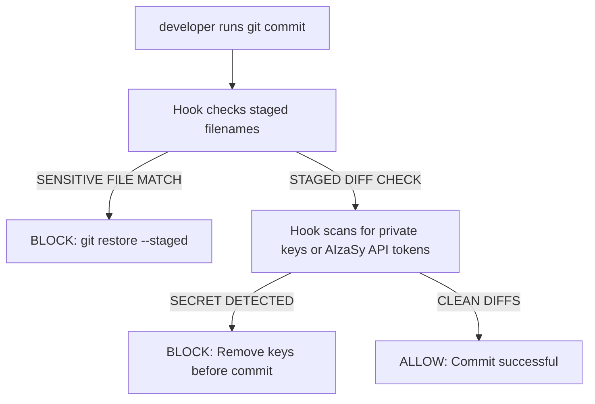

# YeetCode Secure Git & GitHub Workflows

This skill governs the security policies, secret scanning heuristics, pre-commit validation hook installations, and GitHub Actions settings of the YeetCode codebase.

## 1. Secret Leak Prevention System
To protect sensitive credentials (such as Google Cloud private keys, Vercel tokens, or Supabase service keys), we implement multi-layer secret protection:

*   **`.gitignore`**: The root [`.gitignore`](file:///Users/rana-ms-work/Documents/gemini-hackathon/.gitignore) strictly ignores files like `.env`, `.env.local`, `gcp-key.json`, and the `.next/` or `.vercel/` directories.
*   **Local Pre-Commit Scan Hooks**: Set up via [scripts/install-hooks.sh](file:///Users/rana-ms-work/Documents/gemini-hackathon/scripts/install-hooks.sh), which installs an active validator hook in the `.git/hooks/pre-commit` folder.



## 2. Pre-Commit Hook Scanning Heuristics
The pre-commit hook automatically scans:
1.  **Sensitive Filenames**: Rejects commits containing `.env.local`, `gcp-key.json`, `service-account.json`, or `credentials.json`.
2.  **Private Keys**: Searches diffs for standard header blocks (e.g. `-----BEGIN ... PRIVATE KEY-----`).
3.  **Gemini Developer Keys**: Scans diffs for standard Google AI keys matching the regex pattern: `AIzaSy[A-Za-z0-9_-]{30,45}` (skipping `.env.example`, workflows, or configuration files).

## 3. Installation
Developers should execute the installer script upon cloning the repository:
```bash
bash scripts/install-hooks.sh
```

## 4. Guidelines for Future Updates
> [!IMPORTANT]
> - Never bypass commit checks using `--no-verify` unless in isolated, authorized debug runs.
> - If adding dependencies that require system-level certificates or credentials, update `SENSITIVE_FILES` inside [scripts/install-hooks.sh](file:///Users/rana-ms-work/Documents/gemini-hackathon/scripts/install-hooks.sh) to block staging of those credentials.
