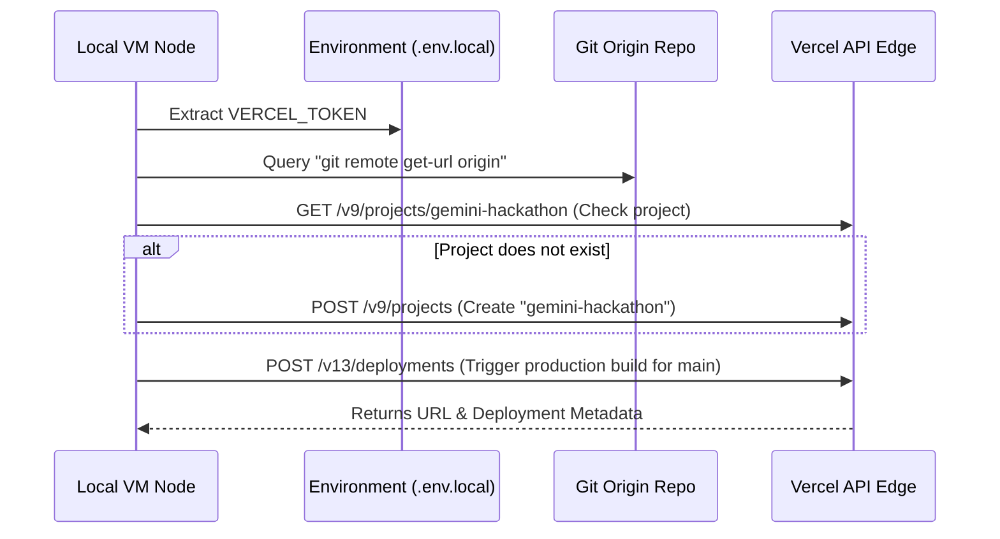

# YeetCode Vercel Integration & Deployment

This skill governs the automated and programmatic delivery of the YeetCode platform to Vercel's edge hosting environment using the official `@vercel/sdk`.

## 1. Automated Setup Script (`scripts/vercel-setup.mjs`)
The platform includes an automated deployment manager in [scripts/vercel-setup.mjs](file:///Users/rana-ms-work/Documents/gemini-hackathon/scripts/vercel-setup.mjs). This node script performs these primary operations:



## 2. Environment Configuration
Programmatic access relies on secure token parameters:
- **`VERCEL_TOKEN`**: A personal access token or team scope token created at `https://vercel.com/account/tokens`. Must be supplied as an environment variable or inside [`.env.local`](file:///Users/rana-ms-work/Documents/gemini-hackathon/.env.local) as `VERCEL_TOKEN="xxx"`.
- **Git Repository Mapping**: The script automatically executes a git terminal command to read the origin repository name. This connects Vercel directly to the source repository so that future pushes to the `main` branch automatically trigger preview and production builds.

## 3. Triggering Deployment Programmatically
You can invoke the custom deployment script anytime via `npm`:
```bash
npm run vercel-setup
```

The script will:
1. Parse the environment for credentials.
2. Confirm if the `gemini-hackathon` project exists on the Vercel workspace. If not, it provisions it automatically under the Next.js framework configuration.
3. Call `vercel.deployments.createDeployment()` to initiate a production deployment on the `main` branch.
4. Output clickable build logs, deployment identifiers, and live production endpoints directly to the terminal.

## 4. Guidelines for Future Updates
> [!WARNING]
> - **SDK Version**: Always verify the `@vercel/sdk` version inside [package.json](file:///Users/rana-ms-work/Documents/gemini-hackathon/package.json) matches the target implementation (v1.x).
> - **Security Bounds**: Never commit `VERCEL_TOKEN` or other deployment keys directly into any source code files. Ensure they are fully captured by the `.gitignore` rule list and verified through pre-commit scan hooks.
> - **Vercel GitHub Integration**: Ensure your Vercel account is connected to your GitHub account to allow the API to link repos programmatically.
